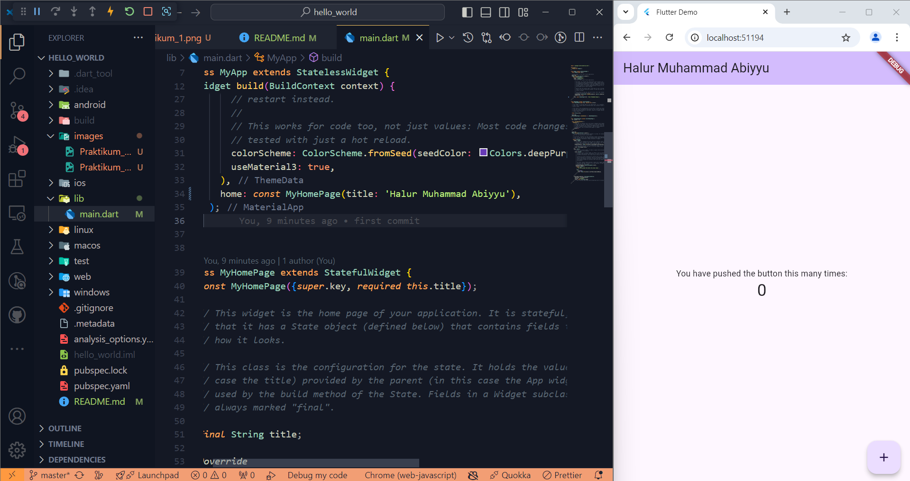

# Project hello_world

Halur Muhammad Abiyyu  
TI 3H  

## Praktikum 1

## Praktikum 2
Menampilkan aplikasi pada handphone pribadi  

## Praktikum 3
Menjalankan Proyek Flutter  

 

Mengganti teks dengan nama lengkap

## Praktikum 4

## Praktikum 5
Loading Widget
 

 

Floating Action Button  

 

Scaffold Widget  

  Dialog Widget  

  Input dan Selection Widget  

  Date dan Time Widget  

## Namer APP

